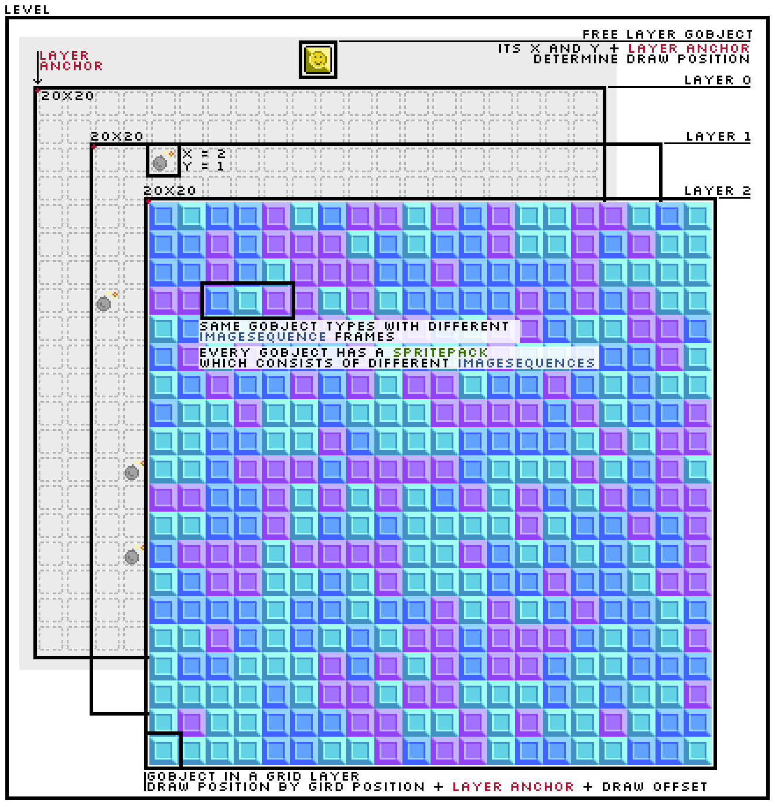

[](https://pkg.go.dev/github.com/greenthepear/egriden)
[](https://goreportcard.com/report/github.com/greenthepear/egriden)

**egriden** is a framework for the [Ebitengine](https://ebitengine.org/) game engine, perfect for creating simple grid-based puzzle or strategy games. 

Current features:
- A **grid layer** system
- **Levels** (aka scenes) and conventional **free layers**
- Expandable "**gobjects**" with assignable draw and update scripts, which populate the two layer types
- Animatable **sprite** system with streamlined image loading using glob patterns or yaml files

There's no abstract grid container for arranging objects to determine the state of your game, instead **the grid is the state**.

It is an evolution of the messy code base created for [TacZ](https://github.com/greenthepear/TacZ) and is currently used by me to [create games](https://madeby.green).

***Currently unstable!*** Contributions of any kind are welcome. Check [the changelog](CHANGELOG.md) for updates.

# Install

This is meant to be used **with** (rather than instead of) Ebitengine so follow the [installation guide for Ebitengine](https://ebitengine.org/en/documents/install.html).

In your go project's directory:
```
$ go get github.com/greenthepear/egriden
```
or to get the latest development version of this repo:
```
$ go get github.com/greenthepear/egriden@main
```

# Guide

A simple guide of egriden's game structure for drawing based on the [gridsweeper](./examples/gridsweeper/) example:



Essentially: 
**Levels ∋ Layers ∋ Gobjects ∋ SpritePacks ∋ ImageSequences ∋ Frames** - **Levels** consist of different **layers** which are populated with **Gobjects** which use **SpritePacks** to organize **ImageSequences**, the **frames** of which get shown on the screen.

# Quick boilerplate tutorial

```go
package main

import (
    "github.com/greenthepear/egriden"
    "github.com/hajimehoshi/ebiten/v2"
)

type Game struct {
    egriden.EgridenAssets //Add assets needed for Egriden
    
    //Anything else you want here.
}

func (g *Game) Draw(screen *ebiten.Image) {
    g.DrawAllGridLayers(screen) //Draw layers according to their Z order

    // or do it your way with g.GridLayer(z).Draw()
}

func (g *Game) Update() error {
    // ... your game logic here
}

func (g *Game) Layout(outsideWidth, outsideHeight int) (int, int) {
    return 320, 320 //Define screen layout
}

func main(){
    // Initialize
    g := &Game{}
    g.InitEgridenAssets()

    layer0 := g.CreateGridLayerOnTop(
		"Background", // Layer name
		GridLayerParameters{
			GridDimensions: Dimensions{10, 12}, // Logical width and heigh of the grid
			CellDimensions: Dimensions{16, 16}, // Cell size in pixels
			Mode:           Sparse, // Draw mode which determines iteration method while drawing
		},
	)

    // Create an image sequence from all the PNGs in a folder
    // Image sequences are made of frames, controlled by the frame index
    seq, err := egriden.CreateImageSequenceFromGlob("idle", "./Graphics/player/idle/*.png")
    if err != nil {
        log.Fatal(err)
    }

    // Create SpritePack with the sequence. A sprite pack can have multiple sequences,
    // which can be switched using their names (keys)
    playerSprites := egriden.NewSpritePackWithSequence(seq)

    // Create Gobject (short for grid object or go object or game object or whatever
    // you like) with the ImageSequence
    goPlayer := egriden.NewBaseGobject("player", playerSprites)

    //Add to layer, Build() method needed for a baseGobject, otherwise create your own
    //structure for the Gobject interface. You can define update, draw
    //functions, sprite drawing options and other fun stuff.
    layer0.AddGobject(goPlayer.Build(), 1, 5)

    //Run the game
    if err = ebiten.RunGame(g); err != nil {
        log.Fatal(err)
    }
}
```

# License
Licensed under the Apache License 2.0 and uses components of Ebitengine by Hajime Hoshi, also licensed under the Apache License 2.0.
